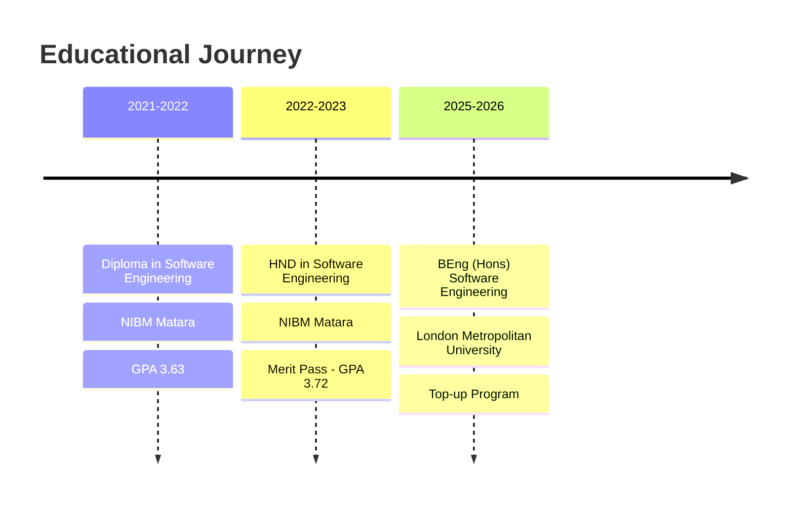

<div align="center">
  
</div>

<div align="center">
  
  [](https://git.io/typing-svg)
  
</div>

<br>

<div align="center">
  
  
  
</div>

<br>


<br>

<div align="center">
   
  
</div>

<br>

<div align="center">
  
</div>

<br>

##  About Me


```typescript
const thisaruNadeeshan = {
    position: "Associate Software Engineer",
    company: "Talpaha Solutions (Pvt) Ltd",
    location: "Matara, Sri Lanka 🇱🇰",
    
    expertise: {
        backend: ["ASP.NET Core", "Web APIs", "Microservices"],
        frontend: ["React", "TypeScript", "Next.js"],
        database: ["SQL Server", "MongoDB", "Redis"],
        ai: ["Dialogflow", "Flowise AI", "Conversational AI"],
        cloud: ["Azure", "Docker", "CI/CD"]
    },
    
    currentlyWorking: [
        "🦷 Smylor.com - Dental appointment platform with AI chatbot",
        "🏪 CityHire.com - Product rental marketplace",
        "📱 MFM.com - Media advertising platform with Flowise AI"
    ],
    
    education: "BEng (Hons) Software Engineering @ London Met University",
    
    philosophy: "Clean code, scalable architecture, continuous learning"
};
```

<br clear="both">

##  Tech Stack & Tools

<div align="center">

### 💻 Backend Technologies
<p align="center">
  
  
  
  
  
  
</p>

### 🎨 Frontend Technologies
<p align="center">
  
  
  
  
  
</p>

### 🗄️ Databases
<p align="center">
  
  
  
  
  
</p>

### 🤖 AI & Cloud
<p align="center">
  
  
  
  
  
</p>

### 🛠️ DevOps & Tools
<p align="center">
  
  
  
  
  
</p>

### 🏠 IoT & Hardware
<p align="center">
  
  
  
  
</p>

</div>

<br>

##  Live Production Projects

<div align="center">

| 🚀 Project | 💡 Description | 🛠️ Tech Stack | 🔗 Status |
|------------|----------------|---------------|-----------|
| **[Smylor.com](https://smylor.com)** | 🦷 Dental appointment booking platform with AI-powered chatbot for patient inquiries and automated scheduling | ASP.NET Core, React, MSSQL, Dialogflow |  |
| **[CityHire.com](https://cityhire.com)** | 🏪 Product rental marketplace connecting owners with renters, featuring real-time availability tracking | ASP.NET Core, React, MongoDB, SignalR |  |
| **[MFM.com](https://mfm.com)** | 📱 Media advertising platform with conversational AI integration using Flowise for campaign optimization | ASP.NET Core, React, MSSQL, Flowise AI |  |

</div>

### 🎯 Key Achievements
<div align="center">
  <table>
    <tr>
      <td align="center">
        
        <br><sub>Across all platforms</sub>
      </td>
      <td align="center">
        
        <br><sub>With AI integration</sub>
      </td>
      <td align="center">
        
        <br><sub>Production reliability</sub>
      </td>
    </tr>
  </table>
</div>

<br>

##  Personal Projects

<div align="center">

### 💼 Full-Stack Applications

| Project | Description | Technologies |
|---------|-------------|--------------|
| **🛍️ T-Ela Badu E-commerce** | Complete e-commerce platform with secure payment gateway integration | PHP, JavaScript, Bootstrap, MySQL |
| **🗺️ Guider Lanka Tourism** | Multi-role tourism platform supporting Admin, Tourist Guide, and Tourist interfaces | PHP, HTML5, CSS3, MySQL |
| **💪 Gym Management Pro** | Comprehensive gym management system with membership tracking and payment processing | React, Spring Boot, MySQL |
| **🔧 Imashi Spare Parts** | Auto parts inventory management with role-based access control | React, TypeScript, Spring Boot |

### 🏠 IoT & Hardware Projects

| Project | Description | Technologies |
|---------|-------------|--------------|
| **🏡 Smart Home System** | Mobile-controlled home automation with 4-channel relay system | NodeMCU ESP8266, Firebase, MIT App Inventor |
| **🚦 Smart Traffic Controller** | Intelligent traffic management using vehicle detection | Arduino, Ultrasonic Sensors, LED Matrix |

</div>

<br>

##  GitHub Activity

<div align="center">
  
</div>

<br>

## 🎓 Education & Certifications

<div align="center">



</div>

<br>

##  Connect With Me

<div align="center">
  
  <a href="https://navod-jayawardana.my.canva.site/j-p-t-nadeeshandeveloper">
    
  </a>
  <a href="https://www.linkedin.com/in/thisaru-nadeeshan-275846219/">
    
  </a>
  <a href="mailto:thisaruc2@gmail.com">
    
  </a>
  <a href="https://github.com/ThisaruNadeeshan">
    
  </a>
  
  <br><br>
  
  <a href="http://github.com/ThisaruNadeeshan/portfolio-/raw/main/Thisaru%20Nadeeshan%20Cv.pdf">
    
  </a>
  
</div>

<br>

## 💭 Dev Quote of the Day

<div align="center">
  
</div>

<br>

## 🐍 Contribution Snake

<div align="center">
  
</div>

<br>

<div align="center">
  
  
  <br>
  
  
  
  ### 🚀 "Building robust backends, one API at a time" 🚀
  
  
</div>
