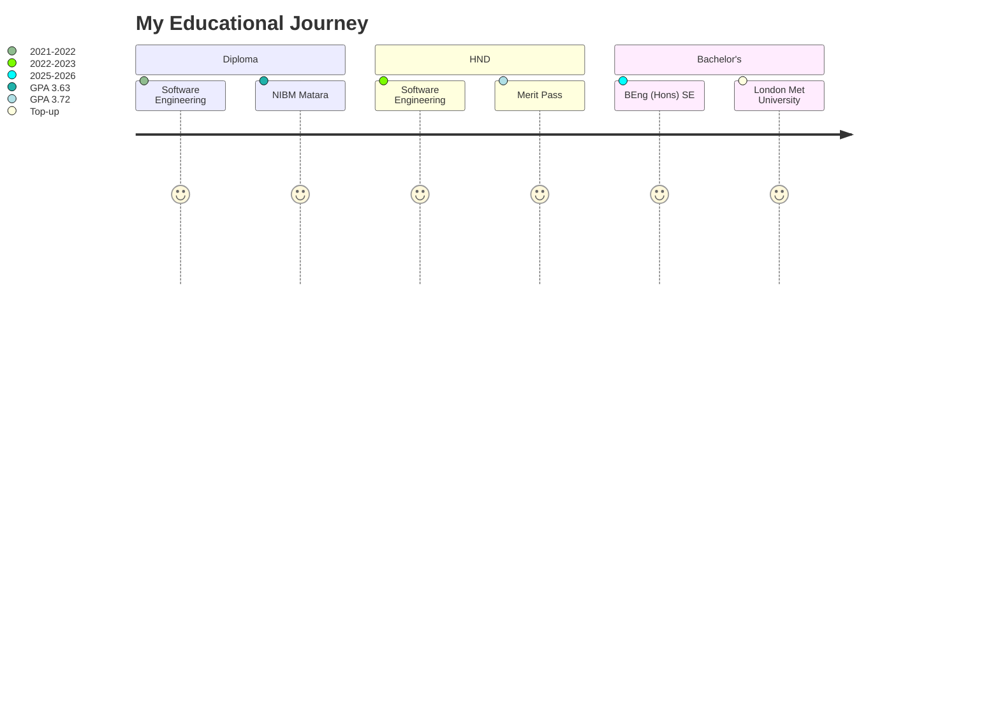

<div align="center">
  
</div>

<div align="center">
  <a href="https://git.io/typing-svg">
    
  </a>
</div>

<p align="center">
  
  
  
  
</p>


<h2 align="center">
   
  About Me 
  
</h2>


```javascript
const thisaruNadeeshan = {
    position: "Associate Software Engineer",
    company: "Talpaha Solutions (Pvt) Ltd",
    location: "Matara, Sri Lanka 🇱🇰",
    
    mainStack: {
        backend: ["ASP.NET Core", "C#", "Web APIs"],
        frontend: ["React", "TypeScript", "Next.js"],
        database: ["SQL Server", "MongoDB", "Redis"],
        ai: ["Dialogflow", "Flowise AI", "Conversational AI"]
    },
    
    liveProjects: {
        "Smylor.com": "🦷 Dental appointment platform with AI chatbot",
        "CityHire.com": "🏪 Product rental marketplace",
        "MFM.com": "📱 Media advertising with Flowise AI"
    },
    
    currentlyLearning: ["Microservices", "Azure DevOps", "Machine Learning"],
    funFact: "I debug with console.log() and I'm proud of it! 😄"
};
```

<br clear="both">

<h2 align="center">🛠️ Tech Stack & Tools</h2>

<div align="center">
  
### Backend Development
<p align="center">
  <a href="https://docs.microsoft.com/en-us/dotnet/csharp/">
    
  </a>
  <a href="https://dotnet.microsoft.com/">
    
  </a>
  <a href="https://dotnet.microsoft.com/apps/aspnet">
    
  </a>
  <a href="https://nodejs.org/">
    
  </a>
  <a href="https://www.java.com/">
    
  </a>
  <a href="https://spring.io/">
    
  </a>
</p>

### Frontend Technologies
<p align="center">
  <a href="https://reactjs.org/">
    
  </a>
  <a href="https://www.typescriptlang.org/">
    
  </a>
  <a href="https://nextjs.org/">
    
  </a>
  <a href="https://developer.mozilla.org/en-US/docs/Web/JavaScript">
    
  </a>
  <a href="https://tailwindcss.com/">
    
  </a>
  <a href="https://getbootstrap.com/">
    
  </a>
</p>

### Database & Cloud
<p align="center">
  <a href="https://www.microsoft.com/en-us/sql-server">
    
  </a>
  <a href="https://www.mongodb.com/">
    
  </a>
  <a href="https://www.postgresql.org/">
    
  </a>
  <a href="https://redis.io/">
    
  </a>
  <a href="https://azure.microsoft.com/">
    
  </a>
  <a href="https://firebase.google.com/">
    
  </a>
</p>

### AI & DevOps Tools
<p align="center">
  <a href="https://cloud.google.com/dialogflow">
    
  </a>
  <a href="https://flowiseai.com/">
    
  </a>
  <a href="https://www.docker.com/">
    
  </a>
  <a href="https://git-scm.com/">
    
  </a>
  <a href="https://visualstudio.microsoft.com/">
    
  </a>
  <a href="https://code.visualstudio.com/">
    
  </a>
</p>

### IoT & Hardware
<p align="center">
  <a href="https://www.arduino.cc/">
    
  </a>
  <a href="https://www.raspberrypi.org/">
    
  </a>
  <a href="https://www.espressif.com/">
    
  </a>
  <a href="https://appinventor.mit.edu/">
    
  </a>
</p>

</div>


<h2 align="center">📊 GitHub Statistics</h2>

<div align="center">
   
  
</div>

<div align="center">
  
</div>

<div align="center">
  
</div>


<h2 align="center">🚀 Live Production Projects</h2>

<div align="center">
<table>
<tr>
<td width="33%" align="center">

<br><br>
<b>AI-Powered Dental Appointments</b><br>
<sub>ASP.NET Core • React • Dialogflow</sub><br>
<sub>Automated scheduling with AI chatbot</sub>
</td>
<td width="33%" align="center">

<br><br>
<b>Product Rental Platform</b><br>
<sub>ASP.NET Core • React • MongoDB</sub><br>
<sub>Real-time availability tracking</sub>
</td>
<td width="33%" align="center">

<br><br>
<b>Smart Advertising Platform</b><br>
<sub>ASP.NET Core • React • Flowise AI</sub><br>
<sub>Conversational AI for campaigns</sub>
</td>
</tr>
</table>
</div>

<div align="center">
  
  
  
  
</div>


<h2 align="center">💻 Personal Projects Showcase</h2>

<div align="center">

| 🎯 Project | 📝 Description | 🛠️ Tech Stack | ⭐ Features |
|------------|----------------|---------------|-------------|
| **T-Ela Badu E-commerce** | Full-stack e-commerce platform | PHP, JavaScript, MySQL | Payment Gateway, Admin Panel |
| **Guider Lanka Tourism** | Multi-role tourism management | PHP, HTML5, CSS3 | 3 User Roles, Booking System |
| **Gym Management Pro** | Complete gym operations suite | React, Spring Boot | Member Tracking, Payments |
| **Smart Home IoT** | Mobile-controlled automation | NodeMCU, Firebase | 4-Channel Relay, App Control |
| **Smart Traffic System** | AI traffic optimization | Arduino, Sensors | Vehicle Detection, LED Matrix |

</div>


<h2 align="center">🎓 Education & Achievements</h2>

<div align="center">



</div>


<h2 align="center">📬 Connect With Me</h2>

<div align="center">
  
<a href="https://navod-jayawardana.my.canva.site/j-p-t-nadeeshandeveloper">
  
</a>
<a href="https://www.linkedin.com/in/thisaru-nadeeshan-275846219/">
  
</a>
<a href="mailto:thisaruc2@gmail.com">
  
</a>
<a href="https://github.com/ThisaruNadeeshan">
  
</a>

<br><br>

<a href="http://github.com/ThisaruNadeeshan/portfolio-/raw/main/Thisaru%20Nadeeshan%20Cv.pdf">
  
</a>

</div>


<h2 align="center">🐍 Contribution Snake</h2>

<div align="center">
  
</div>

<div align="center">
  
</div>


<div align="center">
  
  
  
  
  <br><br>
  
  
  
  
</div>
